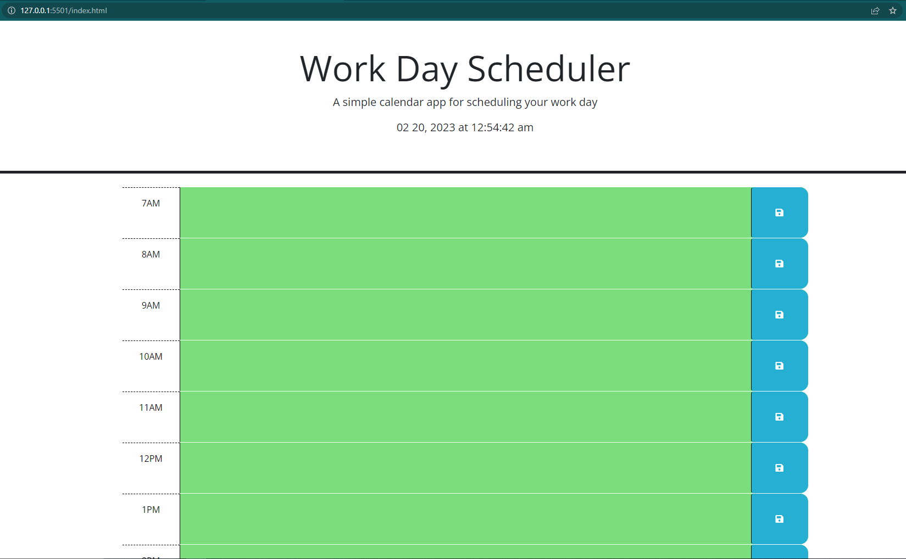

# work-day-scheduler

## Description
Work day scheduler site gives workers a place to input the tasks they need to do in a day and save them to one place.

## Installation
No installation required, simply visit my deployed website link:
https://daniferru.github.io/work-day-scheduler/

## Usage
After opening the deployed link, enter important daily tasks for the corresponding time slot according to what needs to get done at that time and utilizing the blue save button to save information locally.

https://daniferru.github.io/work-day-scheduler/

## Features
- Connected to a third party API which allows for a calander and a clock.
- The color of the hour block is coordinated to past (grey), present (red), or future (green)
- Save feature which allows text to store locally after refreshing the page.